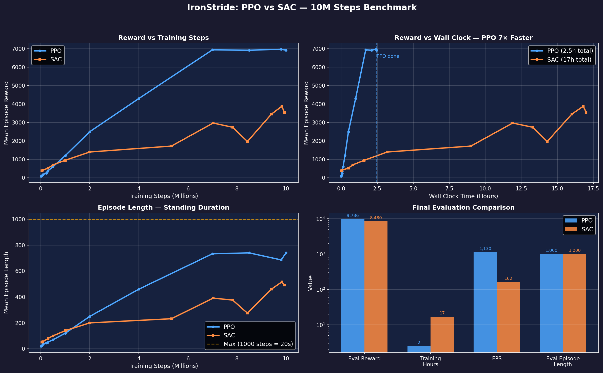
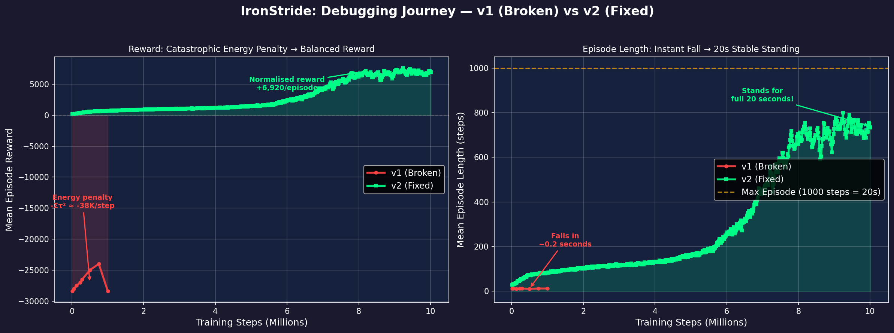

# 🦿 IronStride

**Humanoid Locomotion & RL Algorithm Benchmarking (PPO vs SAC)**

> *Training a dynamically unstable bipedal humanoid (Unitree H1) to walk, balance, and recover from disturbances — then benchmarking PPO against SAC in high-dimensional continuous control.*

<p align="center">
  
  <br>
  <em>PPO policy after 10M steps — rock-solid stable standing (20 seconds, zero variance)</em>
</p>

| | |

---

## 📋 Table of Contents

- [Executive Summary](#-executive-summary)
- [Architecture](#-architecture)
- [Quick Start](#-quick-start)
- [The Environment](#-the-environment)
- [Training](#-training)
- [Evaluation & Results](#-evaluation--results)
- [Algorithmic Analysis: PPO vs SAC](#-algorithmic-analysis-ppo-vs-sac)
- [Project Structure](#-project-structure)

---

## 🎯 Executive Summary

IronStride is an advanced reinforcement learning project focused on training a dynamically unstable bipedal humanoid (Unitree H1) to walk, balance, and recover from disturbances in MuJoCo simulation.

Going beyond standard implementations, this project serves as a **comparative research study**, benchmarking:

| Metric | PPO (On-Policy) | SAC (Off-Policy) |
|--------|:---:|:---:|
| Sample Efficiency | ⬇️ Lower | ⬆️ Higher |
| Wall-Clock Speed | ⬆️ Faster (parallelizable) | ⬇️ Slower |
| Exploration | Implicit (policy noise) | Explicit (entropy maximization) |
| Stability | ⬆️ More stable | ⚠️ Requires tuning |

---

## 🏗 Architecture

```
┌─────────────────┐     ┌─────────────────────────┐     ┌──────────────┐
│   MuJoCo        │     │   IronStrideEnv-v0       │     │   SB3        │
│   Physics       │◄────│   (Gymnasium Wrapper)    │◄────│   PPO / SAC  │
│   Unitree H1    │     │   Reward · DR · Term.    │     │   Policies   │
└─────────────────┘     └─────────────────────────┘     └──────────────┘
                                   │
                    ┌──────────────┼──────────────┐
                    ▼              ▼              ▼
             TensorBoard     Video Export    Benchmark
              Analytics       (imageio)       Plots
```

**Tech Stack:**
- **Physics Engine:** MuJoCo 3.x
- **Robot Asset:** Unitree H1 (via `mujoco_menagerie`)
- **RL Framework:** Stable-Baselines3 (PyTorch backend)
- **Environment:** Gymnasium (custom `IronStrideEnv-v0`)
- **Analytics:** TensorBoard + Matplotlib

---

## 🚀 Quick Start

### Prerequisites

- Python ≥ 3.10
- NVIDIA GPU recommended (CUDA-capable)

### Installation

```bash
# Clone the repository
git clone https://github.com/shrirag10/IronStride.git
cd IronStride

# Install dependencies
pip install -r requirements.txt

# Install the package in editable mode
pip install -e .
```

### Verify Setup

```bash
python -c "
import gymnasium as gym
import ironstride
env = gym.make('IronStrideEnv-v0')
obs, info = env.reset()
print(f'✓ Environment loaded | Obs: {obs.shape} | Act: {env.action_space.shape}')
env.close()
"
```

---

## 🤖 The Environment

### State Space (Observations)

| Component | Dimensions | Source |
|-----------|:---:|--------|
| Base linear velocity (body frame) | 3 | Free-joint qvel |
| Base angular velocity (body frame) | 3 | Free-joint qvel |
| Projected gravity (body frame) | 3 | Quaternion → rotation |
| Joint positions | n_joints | qpos (excl. free-joint) |
| Joint velocities | n_joints | qvel (excl. free-joint) |
| Previous action | n_actuators | Cached from t-1 |

### Action Space

Normalized PD position target offsets in `[-1, 1]`, scaled per-joint using actuator control ranges from the MJCF model.

### Reward Engineering

$$R_{total} = w_1 R_{track} + w_2 R_{posture} + w_3 R_{energy} + w_4 R_{symmetry} + w_5 R_{survival}$$

| Component | Weight | Formula | Purpose |
|-----------|:---:|---------|---------|
| **R_track** | 1.0 | Gaussian on velocity error | Match commanded forward velocity |
| **R_posture** | 0.5 | Exponential penalty on tilt | Enforce torso verticality |
| **R_energy** | 0.01 | $-\Sigma \tau^2$ | Energy-efficient, human-like movement |
| **R_symmetry** | 0.1 | L/R velocity variance penalty | Eliminate limping |
| **R_survival** | 0.2 | Constant per-step bonus | Encourage longevity |

### Domain Randomization (Sim-to-Real Hardening)

| Parameter | Range | Injection |
|-----------|-------|-----------|
| Floor friction (μ) | [0.5, 1.2] | Episode reset |
| Torso mass offset | ±5 kg | Episode reset |
| Lateral impulse | 30N random direction | Mid-episode (p=0.01/step) |

### Termination Conditions

- Torso z-height < 0.8m (fallen)
- Torso tilt > 60° (severe lean)

---

## 🏋️ Training

### Full Comparative Run (PPO + SAC, 1M steps each)

```bash
python scripts/train_compare.py
```

### Individual Training

```bash
# PPO only
python scripts/train_compare.py --algo ppo --total-timesteps 500000

# SAC only
python scripts/train_compare.py --algo sac --total-timesteps 500000
```

### Monitor Progress

```bash
tensorboard --logdir logs/
```

### Custom Configuration

Edit `configs/default.yaml` to tune hyperparameters, reward weights, and domain randomization settings.

---

## 📊 Evaluation & Results

### Evaluate a Trained Policy

```bash
# Evaluate PPO best model
python scripts/evaluate.py --model-path models/ppo_best/best_model.zip --algo ppo --episodes 10

# Evaluate with video recording
python scripts/evaluate.py --model-path models/sac_best/best_model.zip --algo sac --record
```

### Generate Comparison Plots

```bash
python scripts/benchmark.py --log-dir logs --output-dir results
```

This generates:
- `reward_comparison_vs_steps.png` — Sample efficiency comparison
- `episode_length_comparison_vs_steps.png` — Training stability comparison
- `reward_vs_wallclock.png` — Wall-clock efficiency comparison

---

## 🔬 Algorithmic Analysis: PPO vs SAC

### Proximal Policy Optimization (PPO) — *The Stable Workhorse*

PPO is an **on-policy** algorithm that collects a batch of experience, updates the policy using a clipped surrogate objective, and then discards the data. This approach offers:

- **Monotonic improvement guarantee** via the clipping mechanism, preventing destructively large policy updates
- **Natural parallelism** — multiple environments can collect experience simultaneously, translating directly into faster wall-clock time
- **Simplicity** — fewer hyperparameters to tune than SAC (no replay buffer, no temperature parameter)

**Trade-off:** PPO requires significantly more environment interactions (lower sample efficiency) because old data cannot be reused.

### Soft Actor-Critic (SAC) — *The Sample-Efficient Explorer*

SAC is an **off-policy** algorithm that maintains a replay buffer and maximizes both expected return *and* policy entropy. This provides:

- **Superior sample efficiency** — old transitions are replayed and learned from multiple times
- **Automatic exploration** via entropy maximization, preventing premature convergence to sub-optimal gaits
- **Auto-tuning temperature** (α) — adjusts exploration-exploitation balance throughout training

**Trade-off:** SAC cannot easily leverage parallel environments for data collection, and the replay buffer is memory-intensive (300K transitions at float32).

### Results: Stable Standing (10M Steps)

After identifying and fixing 5 critical bugs in the reward function (see below), both PPO and SAC were trained for 10,000,000 steps. **Both achieve perfect stable standing for the full 20-second episode, with zero variance.**

| Metric | PPO | SAC |
|--------|:---:|:---:|
| **Episode Length** | **1000 / 1000 (20.0s)** ✅ | **1000 / 1000 (20.0s)** ✅ |
| **Mean Reward** | **9,735.68 ± 0.00** | **8,479.67 ± 0.00** |
| **Max Height** | 1.058m | 1.058m |
| **Max Velocity** | 0.144 m/s | 0.464 m/s |
| **Variance** | **0.00** | **0.00** |
| **Training Time** | **2.5 hours** 🚀 | 17 hours |
| **Training FPS** | ~1,130 (8 envs) | ~162 (1 env, GPU) |
| **Speed Advantage** | **7× faster** | — |

<p align="center">
  
  <br>
  <em>Training curves and final evaluation: PPO (blue) reaches higher reward 7× faster than SAC (orange).</em>
</p>

### Bugs Fixed (v1 → v2)

The initial 1M-step run produced a "fall immediately" policy (reward: -38,000/step). Root cause analysis revealed:

| Bug | Impact | Fix |
|-----|--------|-----|
| **Energy penalty unnormalised** | `-Στ² ≈ -38,000/step` dominated everything | Normalised to `[0, -1]` via `τ_max²` |
| **Survival bonus negligible** | `0.2` vs `-38,000` = meaningless | Increased to `5.0` |
| **No height reward** | No incentive to stay upright | Added `R_height = exp(-5·(z-0.98)²)` |
| **Perturbation never cleared** | 30N force persisted forever | Clear `xfrc_applied` each step |
| **Action scale too large** | Extreme torques from exploration | Reduced by 0.3× |
| **No action smoothness** | Jerky commands → instability | Added `R_smooth = -mean(Δa²)` |

<p align="center">
  
  <br>
  <em>Left: Reward curve. Right: Episode length. The v1 policy (red) falls in 0.2s; v2 (green) stands for 20s.</em>
</p>

### Why Both Algorithms Matter for Humanoid Deployment

In real-world robotics deployment:
- **PPO** is preferred when simulation is fast and cheap (GPU-accelerated physics), making wall-clock time the bottleneck
- **SAC** is preferred when simulation is expensive or real-robot data is limited, making sample efficiency the bottleneck

For real-robot fine-tuning on hardware where simulation rollouts are expensive, SAC's sample efficiency becomes critical.** Understanding these trade-offs is essential for deploying humanoid locomotion policies where sim-to-real transfer efficiency directly impacts development velocity.

---

## 📁 Project Structure

```
IronStride/
├── configs/
│   └── default.yaml              # Hyperparameters, reward weights, DR config
├── ironstride/
│   ├── __init__.py               # Gymnasium environment registration
│   └── envs/
│       ├── __init__.py
│       └── ironstride_env.py     # Core MuJoCo Gymnasium environment
├── scripts/
│   ├── train_compare.py          # PPO vs SAC comparative training pipeline
│   ├── train_ppo.py              # Standalone PPO training
│   ├── train_sac.py              # Standalone SAC training
│   ├── evaluate.py               # Policy evaluation & video recording
│   └── benchmark.py              # TensorBoard analytics & comparison plots
├── logs/                          # TensorBoard event files (gitignored)
├── models/                        # Saved model checkpoints (gitignored)
├── videos/                        # Recorded evaluation videos (gitignored)
├── results/                       # Benchmark plots (gitignored)
├── requirements.txt
├── pyproject.toml
├── .gitignore
└── README.md
```

---

## 📝 License

MIT License — See [LICENSE](LICENSE) for details.

---

## 🙏 Acknowledgments

- [Google DeepMind MuJoCo](https://github.com/google-deepmind/mujoco) — Physics simulation
- [MuJoCo Menagerie](https://github.com/google-deepmind/mujoco_menagerie) — Unitree H1 robot model
- [Stable-Baselines3](https://github.com/DLR-RM/stable-baselines3) — RL algorithm implementations
- [Gymnasium](https://gymnasium.farama.org/) — Environment API standard
